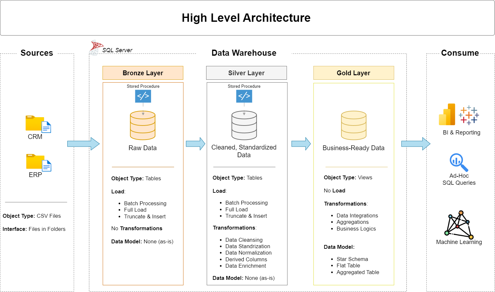
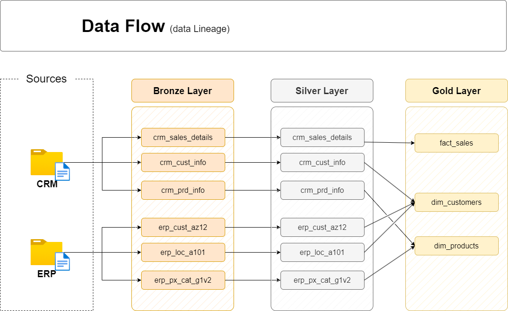

# 🏗️ SQL Data Warehouse Project (PostgreSQL)

## 📌 Overview
This project demonstrates an end-to-end data warehousing solution built with **PostgreSQL**,
following the **Medallion Architecture** (Bronze → Silver → Gold).

The goal is to consolidate raw data from two source systems — **CRM** and **ERP** — and
transform it into clean, business-ready analytical views through structured ETL pipelines.

---

## 🛠️ Tech Stack

| Tool | Purpose |
|---|---|
| PostgreSQL | Primary database engine |
| pgAdmin | Query execution and database management |
| DrawIO | Architecture and flow diagrams |
| GitHub | Version control |

---

## 🏗️ Data Architecture



| Layer | Schema | Description |
|---|---|---|
| **Bronze** | `bronze` | Raw data loaded as-is from CRM and ERP CSV files |
| **Silver** | `silver` | Cleansed, standardized and validated data |
| **Gold** | `gold` | Business-ready views modeled into a star schema |

---

## 🔄 Data Flow



---

## 📊 Data Model


| Object | Type | Description |
|---|---|---|
| `gold.dim_customers` | Dimension Table | Cleaned and integrated customer details including name, gender, marital status, birthdate and country — sourced from CRM and ERP |
| `gold.dim_products` | Dimension Table | Product details including category, subcategory, product line and cost — filtered to active products only |
| `gold.fact_sales` | Fact Table | Sales transactions with order dates, shipping dates, quantity, price and sales amount — linked to customers and products via surrogate keys |

---

## 🛠️ Transformations Applied (Silver Layer)

### Data Cleansing
- Removed duplicates using `ROW_NUMBER()` window function
- Handled NULL and invalid values using `COALESCE` and `CASE`
- Fixed invalid dates stored as integers
- Removed unwanted prefixes and spaces from IDs

### Data Standardization
- Normalized gender values to `Male`, `Female`, `n/a`
- Normalized marital status to `Single`, `Married`, `n/a`
- Normalized country codes to full country names

### Data Enrichment
- Derived product end dates using `LEAD()` window function
- Recalculated incorrect sales figures from quantity and price
- Integrated CRM and ERP customer data — CRM treated as master source

---

## 🧠 Key SQL Concepts Used

```sql
-- Stored Procedures
CREATE OR REPLACE PROCEDURE silver.load_silver()

-- Window Functions
ROW_NUMBER() OVER (PARTITION BY cst_id ORDER BY cst_create_date DESC)
LEAD(prd_start_dt) OVER (PARTITION BY prd_key ORDER BY prd_start_dt)

-- Conditional Logic
CASE WHEN ... THEN ... END
COALESCE(value, 'n/a')

-- Data Type Casting
CAST(CAST(sls_order_dt AS VARCHAR) AS DATE)

-- Aggregations and Joins
LEFT JOIN, GROUP BY, NULLIF()
```

---

## 📂 Project Structure

dwh_project/

├── datasets/

│   ├── source_crm/              # CRM source CSV files

│   └── source_erp/              # ERP source CSV files

├── docs/

│   ├── data_architecture.png    # Architecture diagram

│   ├── data_catalog.md          # Table and column documentation

│   ├── data_flow.png            # Data flow diagram

│   ├── data_integration.png     # Integration diagram

│   └── data_model.png           # Star schema model

├── scripts/

│   ├── bronze/                  # Raw data loading scripts

│   ├── silver/                  # Data cleansing scripts

│   ├── gold/                    # Analytical view scripts

│   └── tests/                   # Data quality test scripts

├── init_database.sql            # Database and schema setup

└── README.md
